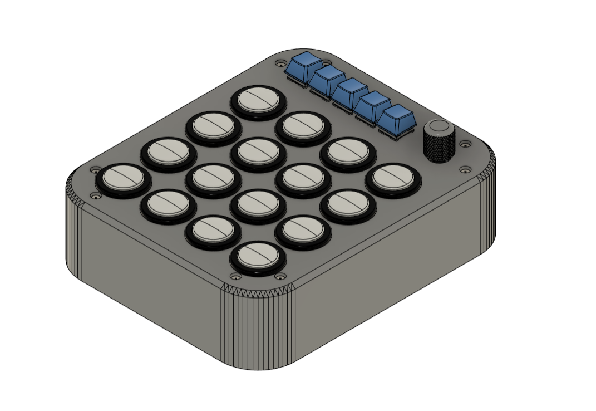

# MIDI CONTROLLER CUSTOM
This is MIDI CONTROLLER Combine with Macropad. Midi controller is for sending midi key to computer, ussually usage for remix musi on DAW Software. Macropad usage to sending macro key that register on QMK/VIA Firmware. there are 2 Microcontroller on this Project, All Microcontroller using Pro Micro and Connected with USB HUB inside Case. Macropad is installed QMK/VIA Firmware and Midi Controller is installed using Arduino Framework. For Button Midi Controller we use Arcade Button and there are 2 RGB LED on each Arcade Button and For Macropad we use MX Mechanical Switch with RGB on South Face.

For Case, we use 3D print that you can download on [this folder]("")

## Preview Hardware

  

